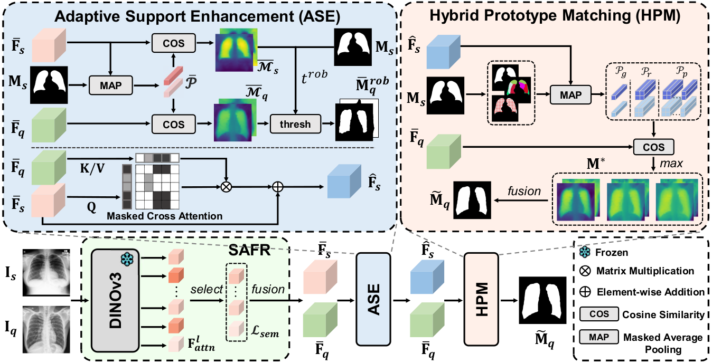

# [ECCV 2026] Training-free Cross-domain Few-shot Segmentation via Robust Semantic Representation and Matching

Official code for ECCV 2026 paper: Training-free Cross-domain Few-shot Segmentation via Robust Semantic Representation and Matching



## Abstract
Cross-domain Few-shot Segmentation (CD-FSS) aims to transfer knowledge learned from source domain to distinct target domains, segmenting unseen target classes with only a few annotated samples. Although existing methods have made significant progress, they still rely on training or fine-tuning processes, which incur high computational costs and risk overfitting. We observe that when powerful and general-purpose vision foundation models are incorporated into these methods, their performance shows only marginal improvement or even degrades due to overfitting. To address this, we eliminate trainable parameters and propose a training-free framework to avoid both training overhead and overfitting. Built upon the self-supervised vision encoder DINOv3, our framework addresses cross-domain challenges through three core modules. First, the Semantic-aware Feature Re-fusion (SAFR) module identifies and re-fuses features that emphasize semantic patterns, generating representations with enhanced semantic discriminability. Additionally, the Adaptive Support Enhancement (ASE) module narrows semantic gaps between support and query through robust query information aggregation. Finally, the Hybrid Prototype Matching (HPM) module integrates matching results from diverse prototypes to adapt to varying semantic complexity across domains. Extensive experiments on four target domain datasets demonstrate that our method achieves state-of-the-art performance in CD-FSS without any training.

## Datasets
You can follow [PATNet](https://github.com/slei109/PATNet) to prepare the target domain datasets.


### Target domains: 

* **Deepglobe**:

    Home: http://deepglobe.org/

    Direct: https://www.kaggle.com/datasets/balraj98/deepglobe-land-cover-classification-dataset
    
    Preprocessed Data: https://drive.google.com/file/d/12Dljy04maKIim3mZsR50CEOC3_ROZLCg/view?usp=sharing

* **ISIC2018**:

    Home: http://challenge2018.isic-archive.com

    Direct (must login): https://challenge.isic-archive.com/data#2018
    
    Class Information: data/isic/class_id.csv

* **Chest X-ray**:

    Home: https://www.ncbi.nlm.nih.gov/pmc/articles/PMC4256233/

    Direct: https://www.kaggle.com/datasets/nikhilpandey360/chest-xray-masks-and-labels

* **FSS-1000**:

    Home: https://github.com/HKUSTCV/FSS-1000

    Direct: https://drive.google.com/file/d/16TgqOeI_0P41Eh3jWQlxlRXG9KIqtMgI/view

## Pretrained models
Download the DINOv3 pretrained weights and place them at
> ```bash
> ~/.cache/torch/hub/checkpoints/
> ```

## Run the code
### Testing 
> ```bash
> CUDA_VISIBLE_DEVICES=0 python -W ignore test.py --dataset deepglobe --datapath ./datasets --backbone dinov3 --size 480 --shot 1
> ```

## Acknowledgement
Our code is built upon the foundations of [DINOv3](https://github.com/facebookresearch/dinov3), [PATNet](https://github.com/slei109/PATNet), [ABCDFSS](https://github.com/Vision-Kek/ABCDFSS) and [SSP](https://github.com/fanq15/SSP). We appreciate the authors for their excellent contributions!